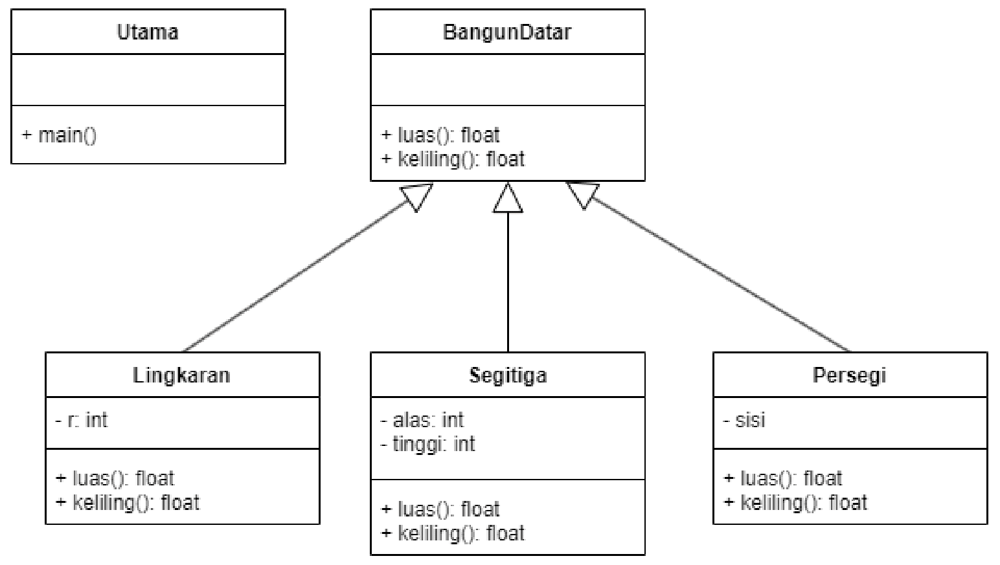
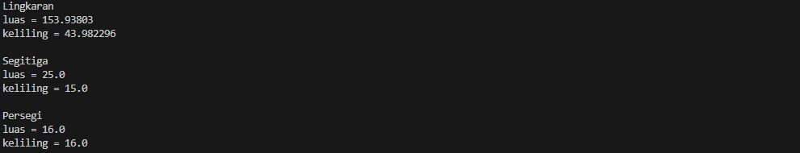

# Pertemuan6_Polimorfisme

## Profil
| Variable | Isi |
| -------- | --- |
| **Nama** | Intan Virginia Aulia Putri |
| **NIM** | 312310657 |
| **Kelas** | TI.23.A.6 |
| **Mata Kuliah** | Pemrograman Orientasi Objek |

### Latihan
Implementasikan java code diagram class berikut:


Bangun Datar
``` javascript
abstract class BangunDatar {
    // Abstract methods Untuk area dan perimeter
    public abstract float luas();
    public abstract float keliling();
}
```
- Kelas `BangunDatar` adalah kelas abstrak yang mendefinisikan metode `luas()` dan `keliling()` sebagai metode abstrak (tanpa implementasi). Ini berfungsi sebagai cetakan untuk kelas turunan yang akan mendefinisikan luas dan keliling berbagai bangun datar.

Lingkaran
``` javascript
class Lingkaran extends BangunDatar {
    private int r;

    public Lingkaran(int r) {
        this.r = r;
    }

    @Override
    public float luas() {
        return (float) (Math.PI * r * r);
    }

    @Override
    public float keliling() {
        return (float) (2 * Math.PI * r);
    }
}
```
- `Lingkaran` adalah kelas yang memperluas `BangunDatar`. Kelas ini memiliki atribut `r` (jari-jari).
- Metode `luas()` menghitung luas lingkaran dengan rumus π * r².
- Metode `keliling()` menghitung keliling lingkaran dengan rumus 2 * π * r.

Segitiga
``` javascript
class Segitiga extends BangunDatar {
    private int alas;
    private int tinggi;

    public Segitiga(int alas, int tinggi) {
        this.alas = alas;
        this.tinggi = tinggi;
    }

    @Override
    public float luas() {
        return (float) (0.5 * alas * tinggi);
    }

    @Override
    public float keliling() {
        
        return (float) (3 * alas);
    }
}
```
- `Segitiga` juga memperluas `BangunDatar`, dengan atribut `alas` dan `tinggi`.
- Metode `luas()` menghitung luas segitiga dengan rumus 0.5 * alas * tinggi.
- Metode `keliling()` mengasumsikan segitiga sama sisi untuk menghitung keliling, yaitu 3 * alas.

persegi
``` javascript
class Persegi extends BangunDatar {
    private int sisi;

    public Persegi(int sisi) {
        this.sisi = sisi;
    }

    @Override
    public float luas() {
        return sisi * sisi;
    }

    @Override
    public float keliling() {
        return 4 * sisi;
    }
}
```
- `Persegi` juga memperluas `BangunDatar` dan memiliki atribut `sisi`.
- Metode `luas()` menghitung luas persegi dengan rumus sisi * sisi.
- Metode `keliling()` menghitung keliling persegi dengan rumus 4 * sisi.

Main class
``` javascript
public class Utama {
    public static void main(String[] args) {
        // Polimorfisme: Menggunakan referensi BangunDatar 
        BangunDatar[] shapes = {
            new Lingkaran(7),
            new Segitiga(5, 10),
            new Persegi(4)
        };

        // Lakukan pengulangan pada setiap bentuk dan cetak nama, luas, dan kelilingnya
        for (BangunDatar shape : shapes) {
            if (shape instanceof Lingkaran) {
                System.out.println("Lingkaran");
            } else if (shape instanceof Segitiga) {
                System.out.println("Segitiga");
            } else if (shape instanceof Persegi) {
                System.out.println("Persegi");
            }
            
            System.out.println("luas = " + shape.luas());
            System.out.println("keliling = " + shape.keliling());
            System.out.println(); // Untuk Spasi
        }
    }
}
```
- Kelas `Utama` memiliki metode `main` yang merupakan titik awal program.
- Kode ini menggunakan array `BangunDatar[]` yang menyimpan objek `Lingkaran`, `Segitiga`, dan `Persegi`. Ini merupakan penerapan **polimorfisme**, di mana setiap objek memiliki tipe `BangunDatar` namun berperilaku sesuai dengan kelas aslinya.
- Loop `for` iterasi setiap objek dalam array, memeriksa tipe objek menggunakan `instanceof`, dan mencetak nama bangun datar bersama dengan luas dan kelilingnya.
  
#### Tampilan Output

